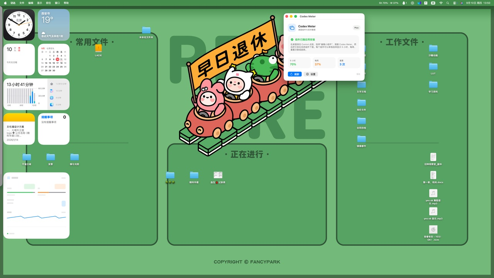

# Codex Meter

[](https://github.com/jiffive-cell/codex-meter/actions/workflows/ci.yml)
[](https://github.com/jiffive-cell/codex-meter/releases)
[](LICENSE)
[](https://www.apple.com/macos/)

Native macOS menu bar and WidgetKit quota monitor for Codex. Codex Meter is read-only: it shows the rate-limit windows, reset credits, freshness, and local usage trend that are available from the Codex app-server.

> Current release: `0.4.0` · macOS 14+ · Swift 6 · MIT License
>
> Codex Meter is an independent open-source project and is not affiliated with or endorsed by OpenAI.



## Why Codex Meter?

Codex quota state is easy to miss while working. Codex Meter turns that state into a small native surface that is useful at a glance and scriptable when needed:

- menu bar popover for current quota, plan, reset timing, and consumption rate;
- native widgets for 5-hour, weekly, reset-credit, and recent-usage views;
- `codex-meter status --json` for scripts and the bundled Codex Meter Status Skill;
- no message-count guesses, account mutations, reset redemption, prompt access, or conversation browser.

## What happens to data?

The boundary is intentionally explicit:

```text
Codex Meter
    │  local JSON-RPC over stdin/stdout
    ▼
locally installed `codex app-server`
    │  authentication and service communication are handled by Codex
    ▼
`account/rateLimits/read` response
    │
    ├─ local menu bar state
    ├─ local history and WidgetKit snapshot
    └─ read-only CLI JSON / Skill output
```

Codex Meter itself does not make direct HTTP requests, send analytics, or upload prompts, conversation content, project files, or credentials. It does not open or parse `auth.json`. It starts the locally installed Codex executable and asks its app-server only for the read-only `account/rateLimits/read` response; the Codex process remains responsible for its own authentication and communication with its service. See [PRIVACY.md](PRIVACY.md) and [SECURITY.md](SECURITY.md) for the full boundary and limitations.

## Features

- Uses the service response as the source of truth and preserves unknown plan tiers instead of guessing.
- Shows 5-hour, daily, weekly, and other server-returned quota windows with used/remaining percentages and reset times.
- Shows available reset count, reset-credit titles, and expiry times when the service provides them.
- Sends deduplicated 20% / 10% / 5% local notifications, configurable in Settings.
- Calculates a local consumption trend and estimated exhaustion time from recent samples; it does not predict a number of messages.
- Keeps up to 30 days of local history, with Chinese/English UI and system/colorful/dark widget appearances.
- Offers 1 / 5 / 15 / 30 minute refresh intervals and optional launch at login.

## Install

### Download a release

Download the latest DMG from [GitHub Releases](https://github.com/jiffive-cell/codex-meter/releases). The `v0.4.0` package is a locally signed build; a future public distribution should use Developer ID signing and notarization.

### Build locally

Requirements: macOS 14+, Swift 6 or Xcode Command Line Tools, and a locally installed and signed-in Codex desktop environment.

```bash
swift test
./scripts/build-app.sh
./scripts/install-app.sh
```

The install script copies the app to `/Applications/Codex Meter.app`, registers the widget extension, launches the menu bar app, and creates `~/bin/codex-meter` only when that path is empty or already a symlink. If `~/bin` is not on `PATH`, run:

```bash
"/Applications/Codex Meter.app/Contents/Helpers/codex-meter" status --json
```

The local package uses ad-hoc signing. If Gatekeeper blocks it, open the app from Finder with Control-click → **Open**. Ad-hoc signing is not a substitute for Developer ID signing or notarization.

## Use the app and widgets

1. Launch **Codex Meter**; its status item appears in the menu bar.
2. Click the status item to view plan, quota windows, reset credits, trend, and last update.
3. Use **Refresh** to ask the local Codex app-server for a new read-only snapshot.
4. Control-click the desktop → **Edit Widgets** → search for **Codex Meter** and choose a widget variant.

WidgetKit decides the exact refresh time. If a widget is stale, open the app and press **Refresh**, then allow macOS to deliver the next widget timeline.

The SwiftPM/Command Line Tools build exposes five static widget variants. A full Xcode WidgetKit build can also enable the prepared AppIntent configuration by adding `CODEX_METER_APPINTENTS` to the Widget target's Active Compilation Conditions.

## CLI and Skill

`status --json` reads the last local snapshot and never starts Codex or mutates account state:

```bash
codex-meter status --json
```

The JSON includes the schema version, plan, all quota windows, reset credits, local trend, estimated exhaustion time, and `stale`. A snapshot older than 30 minutes, or one without a timestamp, is marked stale rather than guessed.

Install the bundled Skill with:

```bash
cp -R skills/codex-meter-status ~/.codex/skills/
```

The Skill only reads the local JSON command. It does not read credentials, conversations, or projects; start tasks; or redeem reset credits.

## Build, test, and release checks

For a local change:

```bash
swift test
swift build
./scripts/build-app.sh
./scripts/smoke-test.sh
```

`swift test` and `swift build` are deterministic local checks. `scripts/build-app.sh` additionally assembles and ad-hoc signs the app and widget. `scripts/smoke-test.sh` talks to a real local Codex app-server, so it requires a signed-in Codex environment and is intentionally not part of ordinary CI.

Before a release, verify the versions in `Resources/Info.plist`, `Resources/WidgetInfo.plist`, the host initialization metadata, and this README; run the checks above; generate SHA-256 hashes for uploaded DMG/ZIP/Skill assets; and publish a new immutable `vX.Y.Z` tag without replacing earlier release assets. See [CONTRIBUTING.md](CONTRIBUTING.md) for the maintainer checklist.

## Privacy and security

Local files used by the app include:

- `~/Library/Application Support/CodexMeter/history.json` for up to 30 days of trend samples;
- `~/Library/Application Support/CodexMeter/widget-snapshot.json` for the latest minimal widget snapshot;
- macOS preferences for display and connection settings.

The sandboxed widget receives a mirrored local snapshot in its container. This is a local ad-hoc-build compatibility path; a signed distribution can replace it with a protected App Group container. The widget only renders the snapshot and never launches Codex.

For the exact data flow, retention, reporting route, and release-signing limitations, read [PRIVACY.md](PRIVACY.md) and [SECURITY.md](SECURITY.md). Do not include credentials, full logs, prompts, conversations, or unredacted account responses in an Issue or pull request.

## Troubleshooting

| Symptom | What to check |
| --- | --- |
| Popover shows old data | Confirm Codex is signed in, press **Refresh**, and inspect the update time and `stale` field. |
| Widget is not in the gallery | Confirm the app is in `/Applications`, rerun `./scripts/install-app.sh`, then reopen **Edit Widgets**. |
| CLI command is not found | Add `~/bin` to `PATH` or use the absolute helper path shown above. |
| A server-returned window shows 0% | Treat it as its own named limit; do not infer that it is the primary Codex window. |
| Codex executable is not found | Set the Codex path in Settings or install the Codex executable in one of the supported local locations. |

## Repository layout

```text
Sources/CodexMeter/          menu bar host, protocol models, and view model
Sources/CodexMeterWidget/    WidgetKit extension and static/AppIntent variants
Sources/CodexMeterShared/    snapshot model, freshness rule, and CLI JSON contract
Sources/CodexMeterCLI/       codex-meter status --json
Tests/CodexMeterTests/       deterministic protocol, snapshot, history, and JSON tests
skills/codex-meter-status/   bundled read-only Codex Skill
scripts/                     build, install, and local protocol smoke checks
.github/                     CI, issue templates, and pull request template
```

## Contributing and support

Bug reports and feature ideas are welcome through [GitHub Issues](https://github.com/jiffive-cell/codex-meter/issues). Include macOS version, Codex version, and a redacted `status --json` shape; never paste credentials, session content, or complete logs. Security reports should follow [SECURITY.md](SECURITY.md), not a public Issue.

See [CONTRIBUTING.md](CONTRIBUTING.md) for build and review expectations. This project is released under the [MIT License](LICENSE).
